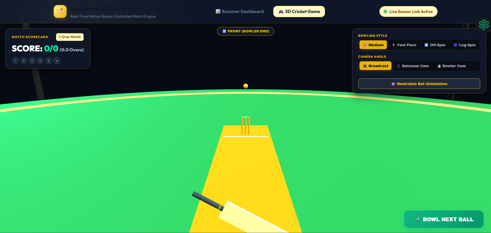
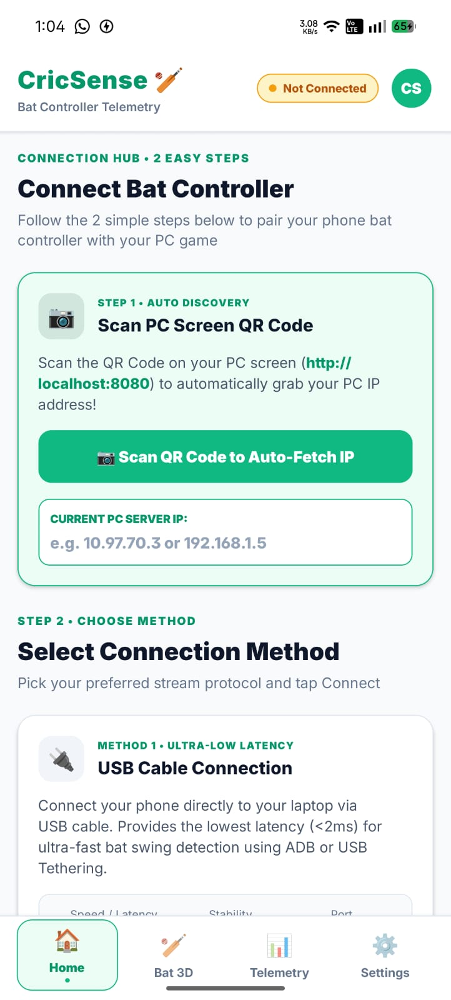
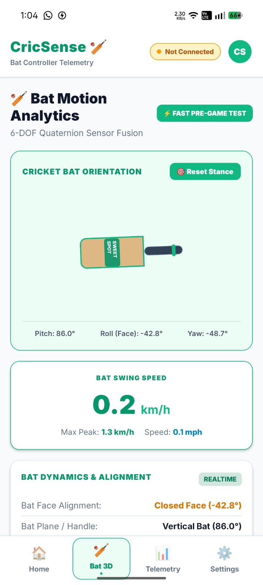
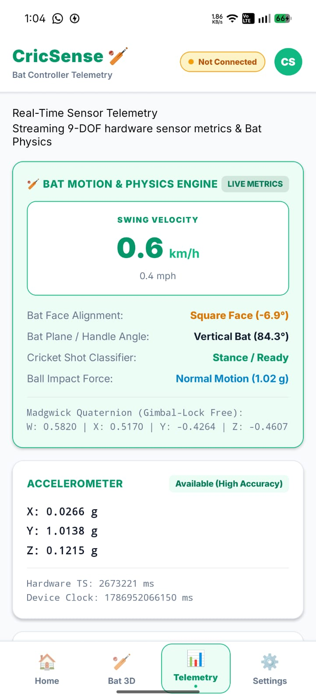
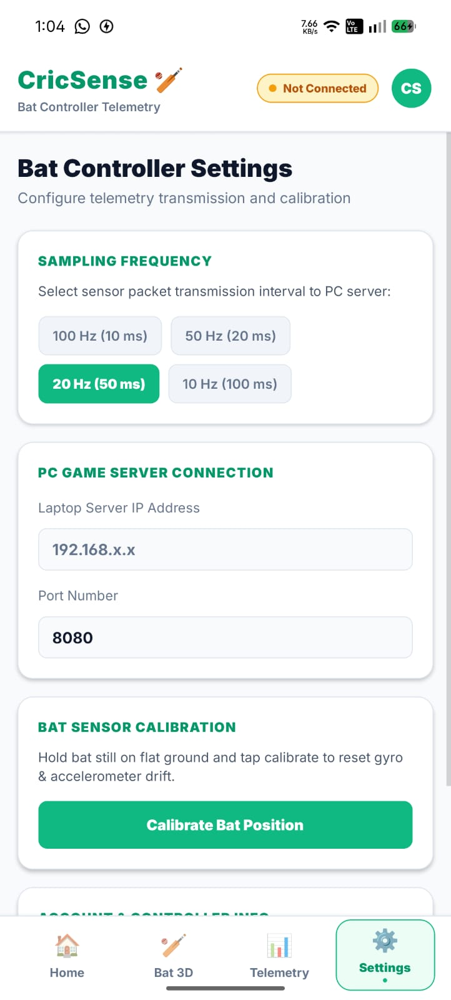

# CricSense Telemetry System

A professional high-precision motion tracking system and real-time telemetry pipeline for physical cricket bats. The system utilizes a dual-tier architecture: a mobile-based IoT hardware telemetry collector and a high-performance PC/Laptop game processing engine.

---

## 📸 Application Previews & Screenshots

### 💻 PC / Laptop Telemetry Engine & 3D Cricket Match Arena
| Web Receiver Dashboard | 3D Stadium Cricket Match Arena |
| :---: | :---: |
|  |  |

### 📱 Mobile Bat Controller Application
| Step 1 & 2 Connection Hub | 3D Bat Stance & Physics Engine |
| :---: | :---: |
|  |  |

| Real-Time Telemetry Monitor | Telemetry & Calibration Settings |
| :---: | :---: |
|  |  |

---

## Tech Stack & Core Technologies


---

## System Architecture Overview

The system consists of two primary operational components:

1. **Hardware Sensor Bat Controller (Mobile Application)**
   - Mounted onto a physical cricket bat or held as a dedicated controller.
   - Features a modular UI with Top Header (Account profile), Main Content View, and Bottom Navigation Footer (**Home**, **Data**, **Settings**).
   - Captures high-frequency 9-DOF motion telemetry via onboard Accelerometer, Gyroscope, DeviceMotion (Rotation & Orientation), and Magnetometer sensors at 50ms intervals (20Hz).
   - Attaches microsecond hardware event timestamps and high-resolution device clock timestamps (`Date.now()`).

2. **Game Processing Engine (PC / Laptop)**
   - Receives and parses real-time sensor data packet streams from the bat controller.
   - Computes orientation compensation, trajectory dynamics, impact timing, stroke force magnitude, and bat speed (km/h).
   - Renders the interactive Cricket Game simulation on the primary PC or Laptop display.

---

## Modular Application Navigation Structure

- **Header Component**: Displays CricSense branding, active PC connection status, and Account profile avatar.
- **Home Screen**: Displays game information, system architecture overview, bat controller mounting instructions, and readiness status.
- **Data Screen**: Displays real-time 9-DOF sensor cards (Accelerometer, Gyroscope, DeviceMotion Rotation/Orientation, Magnetometer, status badges, and timestamps).
- **Settings Screen**: Allows customizing telemetry sampling rate (10ms to 100ms), configuring PC Server IP pairing, and performing bat sensor calibration.
- **Footer Navigation Bar**: Persistent tab bar at the bottom allowing seamless switching between **Home**, **Data**, and **Settings**.

---

## Repository Structure

```
motion sensor game/
├── .gitignore             # Version control exclusions for dependencies and build artifacts
├── README.md              # Project documentation and system architecture guide
└── app/                   # Mobile Sensor Telemetry Client
    ├── App.js             # Root container & navigation state
    ├── app.json           # Expo application configuration
    ├── babel.config.js    # Babel compiler configuration
    ├── package.json       # Dependencies and build scripts
    └── src/               # Modular application codebase
        ├── components/    # Reusable UI components
        │   ├── Header.js  # Top bar with account button and PC connection badge
        │   └── Footer.js  # Bottom tab bar (Home, Data, Settings)
        ├── hooks/         # Custom React hooks
        │   └── useSensorData.js  # Sensor subscription and telemetry state manager
        └── screens/       # Screen view pages
            ├── HomeScreen.js      # Game overview & bat mounting guide
            ├── DataScreen.js      # Live real-time multi-sensor telemetry metrics
            └── SettingsScreen.js  # Telemetry frequency, server IP & calibration
```

---

## Installation & Deployment

### Prerequisites
- Node.js (Version 18.0.0 or higher)
- npm or yarn package manager
- Expo Go mobile application for physical sensor acquisition

### Setup Instructions

1. Navigate to the mobile client directory:
   ```bash
   cd app
   ```

2. Install required dependencies:
   ```bash
   npm install
   ```

3. Launch the sensor acquisition server:
   ```bash
   npx expo start
   ```

4. Pair the mobile controller device by scanning the QR code using Expo Go.

---

## License

Distributed under the MIT License. Copyright (c) 2026 CricSense Engineering.
